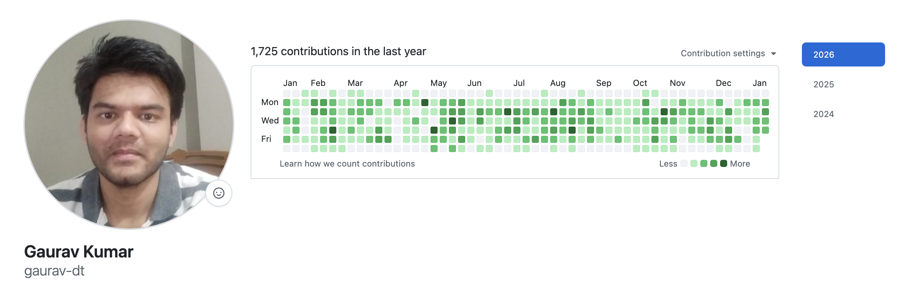

<h1 align="center">Hey, I'm Gaurav Kumar 👋</h1>

  <strong>Frontend Engineer @ Drivetrain AI</strong> • <strong>IIT Kanpur '23</strong>

  
  
  

---

### 🚀 About Me

- 🔭 Currently building **frontend** at Drivetrain AI
- 🛠️ I build **fast, type-safe frontend applications** at high-growth startups
- 💡 I care deeply about **developer experience**, **performance**, and **shipping products users love**

---

### 🛠️ Tech Stack

  
  
  
  
  

  
  
  
  

---

### 🌟 Open Source Contributions

I have contributed to popular open source projects:

| Project | PR | Description |
|---------|-----|-------------|
| **TanStack Query** (40k+ ⭐) | [#10011](https://github.com/TanStack/query/pull/10011) | Fixed ESLint plugin exhaustive-deps rule for Vue files |
| **TanStack Query** (40k+ ⭐) | [#10006](https://github.com/TanStack/query/pull/10006) | Fixed DevTools state isolation for multiple instances |
| **query.gg** | — | Found and reported error in ui.dev's official course |
| **GreatFrontEnd** | — | Contributed test case to interview prep platform |

### 🏢 Work GitHub Activity

> 💼 Most of my daily coding happens on my **company GitHub account**.

🔗 **Work Account:** [github.com/gaurav-dt](https://github.com/gaurav-dt)

  

<em>Contribution graph from Drivetrain AI (Dec 2024 - Present)</em>

### 💼 What I've Shipped (at work)

While I can't share code, here's what I've built:

| Project | Impact |
|---------|--------|
| 🔌 **Google Sheets Add-ons** | Got Google sheets addon published import for customer board decks |
| 📄 **PDF Automation System** | Reports with pagination & custom covers for board meetings |
| ⚡ **CI/CD Optimization** | Reduced pipeline time by 75% (6min → 1.5min) |
| 🔧 **Figma Plugin** | Auto-converts designs to production React components |
| 🌍 **EU Number Formatting** | Internationalization across entire codebase |

---

### 📫 Let's Connect

  <a href="https://www.linkedin.com/in/gaurav-kumar-84b361188/">LinkedIn</a> •
  <a href="mailto:gk9848970@gmail.com">Email</a>

  

